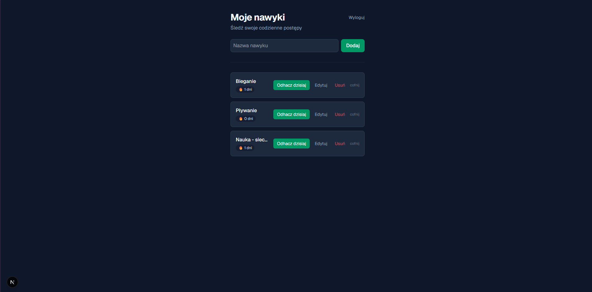
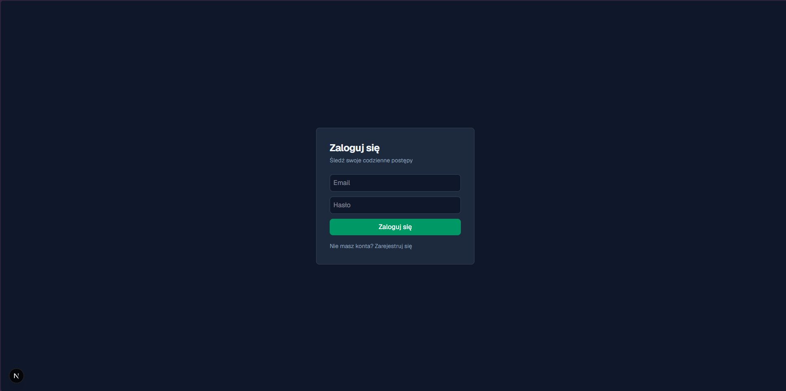

# 🔥 Tracker Nawyków


Aplikacja webowa do śledzenia codziennych nawyków. Pozwala tworzyć własne nawyki, odhaczać je każdego dnia i automatycznie liczy **serię (streak)** - liczbę dni z rzędu, w których nawyk został wykonany. Każdy użytkownik ma własne konto i widzi wyłącznie swoje dane.

### 🔗 [**Zobacz demo na żywo**](https://tracker-nawykow-henna.vercel.app/login)

---

## 📸 Zrzuty ekranu






---

## ✨ Funkcje

| | |
|---|---|
|  **Rejestracja i logowanie** | Uwierzytelnianie e-mailem i hasłem (Supabase Auth) |
|  **Izolacja danych** | Każdy użytkownik widzi i edytuje wyłącznie własne nawyki |
|  **Zarządzanie nawykami** | Dodawanie, edycja nazwy w miejscu, usuwanie |
|  **Odhaczanie dzienne** | Oznaczanie nawyku jako wykonanego danego dnia (z możliwością cofnięcia) |
|  **Liczenie serii** | Streak wyliczany z historii odhaczeń, a nie przechowywany jako statyczna liczba |
|  **Ochrona przed duplikatami** | Ograniczenie `UNIQUE` w bazie blokuje dwukrotne odhaczenie tego samego dnia |

---

## 🛠️ Stack technologiczny

| Warstwa | Technologia |
|---|---|
| Framework | Next.js 16 (App Router, Server Actions) |
| Język | TypeScript |
| Stylowanie | Tailwind CSS |
| Baza danych | PostgreSQL (Supabase) |
| Uwierzytelnianie | Supabase Auth + Row Level Security |
| Hosting | Vercel |

---

## 🧠 Architektura i decyzje projektowe

**Server Actions zamiast osobnego API**
Operacje na bazie (dodawanie, edycja, usuwanie nawyków, odhaczanie) realizowane są przez Server Actions Next.js, co eliminuje potrzebę pisania osobnej warstwy REST API.

**Streak liczony z historii, nie przechowywany**
Zamiast trzymać licznik serii jako pole w tabeli (co wymagałoby ręcznej aktualizacji i groziło rozjechaniem się z rzeczywistością), seria wyliczana jest na bieżąco z tabeli `completions` przez funkcję `lib/streak.ts`. Wartość zawsze odpowiada faktycznej historii.

**Relacja jeden-do-wielu**
Tabela `completions` przechowuje osobny wiersz dla każdego dnia wykonania nawyku (`habit_id` + `date`). Taki model - zamiast pojedynczego pola `done` - pozwala odtworzyć pełną historię i policzyć serię wstecz.

**Row Level Security**
Izolacja danych między użytkownikami wymuszona jest na poziomie **bazy danych** przez polityki RLS (`auth.uid() = user_id`), a nie wyłącznie przez filtrowanie w kodzie aplikacji. Nawet bezpośrednie zapytanie do bazy z pominięciem interfejsu nie pozwoli odczytać cudzych danych.

---

## 🗄️ Schemat bazy danych

```
habits
├── id          bigint, PK
├── created_at  timestamptz
├── name        text
└── user_id     uuid  → auth.users(id)  [ON DELETE CASCADE]

completions
├── id          bigint, PK
├── created_at  timestamptz
├── habit_id    bigint → habits(id)     [ON DELETE CASCADE]
└── date        date

UNIQUE (habit_id, date)  ← brak możliwości podwójnego odhaczenia w tym samym dniu
```

Pełny schemat wraz z politykami RLS znajduje się w pliku [`supabase/schema.sql`](supabase/schema.sql).

---

## 🚀 Uruchomienie lokalne

> Aplikacja korzysta z własnej instancji Supabase, więc lokalne uruchomienie wymaga założenia darmowego projektu.
> Jeśli chcesz tylko zobaczyć, jak działa to [**skorzystaj z demo**](https://tracker-nawykow-henna.vercel.app/login).

**Wymagania:** Node.js 18+ oraz darmowe konto [Supabase](https://supabase.com)

**1. Sklonuj repozytorium**

```bash
git clone https://github.com/miloszekxk/Tracker-Nawykow
cd tracker-nawykow
npm install
```

**2. Utwórz projekt w Supabase i zbuduj schemat bazy**

Załóż nowy projekt w panelu Supabase, a następnie otwórz **SQL Editor → New query**, wklej zawartość pliku [`supabase/schema.sql`](supabase/schema.sql) i uruchom (*Run*).

Utworzy to obie tabele, ograniczenia oraz komplet polityk Row Level Security.

**3. Wyłącz potwierdzanie e-mail (opcjonalnie, dla wygody testów)**

*Authentication | Providers | Email* | wyłącz **Confirm email**.

**4. Uzupełnij zmienne środowiskowe**

Utwórz plik `.env.local` w korzeniu projektu. Dane znajdziesz w *Project Settings → API*:

```env
NEXT_PUBLIC_SUPABASE_URL=twój_url_projektu
NEXT_PUBLIC_SUPABASE_ANON_KEY=twój_klucz_anon
```

**5. Uruchom serwer deweloperski**

```bash
npm run dev
```

Aplikacja będzie dostępna pod `http://localhost:3000` 

---

## 🗺️ Możliwe kierunki rozwoju

-  Wizualizacja historii w formie heatmapy (kalendarz aktywności)
-  Statystyki: łączna liczba wykonań, najdłuższa seria w historii
-  Przypomnienia i powiadomienia
-  Kategorie i tagi nawyków